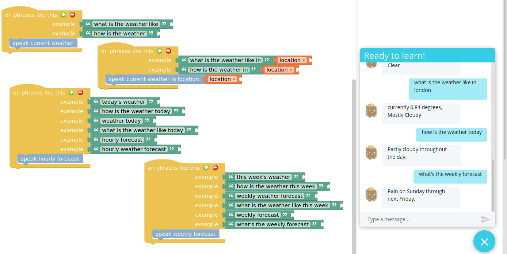
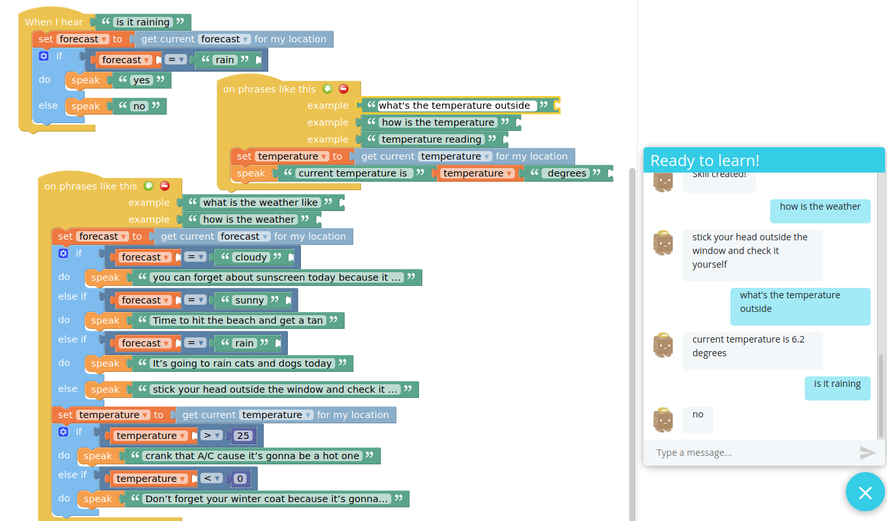

# Weather - Chatterbox Skill

Get weather data from [DarkSky](https://darksky.net)

units (metric or imperial) can be set in the configuration tab

NOTE: There are multiple skills in this repo

## Basic weather skill

Examples

    "how is the weather"
    "what is the weather like in {location}"
    "what's the weekly forecast"

## Moody weather man skill

Examples

    "how is the weather"

